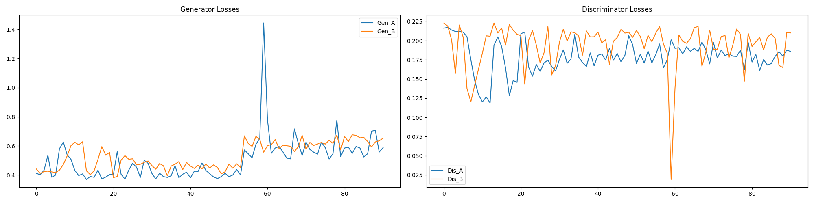

# Архитектура модели 
Используется `CycleGAN`, с `ResidualGan` в качестве генератора


## Генератор
- downsample block
```python
nn.Conv2d(in_features, out_features, 3, stride=2, padding=1),
nn.InstanceNorm2d(out_features),
nn.ReLU(inplace=True)
```
- residual block
```python
nn.Conv2d(in_features, in_features, 3, padding=1, padding_mode='reflect'),
nn.InstanceNorm2d(in_features),
nn.ReLU(inplace=True),
nn.Conv2d(in_features, in_features, 3, padding=1, padding_mode='reflect'),
nn.InstanceNorm2d(in_features)
``` 
- upsample block  
```python
nn.Conv2d(in_features, out_features * 4, kernel_size=3, padding=1, padding_mode='reflect'),
nn.PixelShuffle(2),
nn.InstanceNorm2d(out_features),
nn.ReLU(inplace=True)
```

В качестве `upsample` используется в основе `pixelshuffle` для улучшения качества в сравнении. Выбор был основан на данной [статье](https://arxiv.org/pdf/1609.05158).
В финальном генераторе по одному `downsample` и `upsample`, 2 `residual` блока, с размером скрытого состояния 96. Я эксперимаентировал с несколько иными параметрами, результаты чего описаны [тут](EXPERIMENTS.md).

## Дискриминатор
В нем нет ничего оснобеннего, несколько интересного, просто несколько сверток с нормализацией и все.
```python
h = hidden_size
model = [   
    nn.Conv2d(input_nc, h, 4, stride=2, padding=1),
    nn.LeakyReLU(0.2, inplace=True) 
]

for _ in range(hidden_n):
    h_next = h*2
    model += [
            nn.Conv2d(h, h_next, 4, stride=2, padding=1),
            nn.InstanceNorm2d(h_next),
            nn.LeakyReLU(0.2, inplace=True)
        ]
    h = h_next

model += [nn.Conv2d(h, 1, 4, padding=1)]
```

## Обучение 
Весь процесс представлен в в этом [ноутбуке](../train/notebooks/train_CycleGAN.ipynb). Здесь будет краткое описание:
- Оптимизаторы
```python
optimizer_G = torch.optim.Adam(
    itertools.chain(netG_A2B.parameters(), netG_B2A.parameters()),
    lr=(lr*gen_lr_coef), 
    betas=(0.5, 0.999)
)

optimizer_D_A = torch.optim.Adam(
    netD_A.parameters(), 
    lr=(lr*disc_lr_coef), 
    betas=(0.5, 0.999)
)
optimizer_D_B = torch.optim.Adam(
    netD_B.parameters(), 
    lr=(lr*disc_lr_coef), 
    betas=(0.5, 0.999)
)
```
У генераторов один оптимизатор, как это реализовано в оригинальном `CycleGAN`. Хотя можно было бы их разделить и вычислять `cycle loss` дважды, замораживая градиенты генераторов по отдельности. Увы, на этот эксперимент времени не хватило.
- Функции потерь
```python
criterion_identity = torch.nn.L1Loss()
criterion_GAN = torch.nn.MSELoss()
criterion_cycle = torch.nn.L1Loss()
```
Во время обучения они будут умножаться на коэффициенты `[0.5, 1, 10]` затем на `[0.5, 1.5, 12]` соответственно, такой метод выведен экспериментально.



Скачок вызван изменением коэффициентов