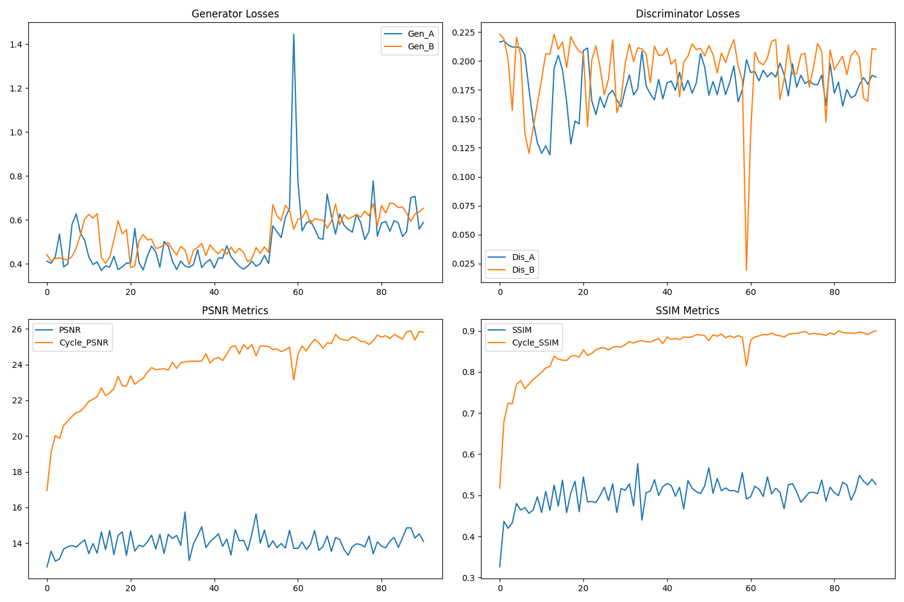

# Архитектура модели 
В проекте используется модель `CycleGAN`, где в качестве генератора применена архитектура `ResidualGAN`.


## Генератор
Архитектура генератора состоит из следующих блоков:
- downsample block
```python
nn.Conv2d(in_features, out_features, 3, stride=2, padding=1),
nn.InstanceNorm2d(out_features),
nn.ReLU(inplace=True)
```
- residual block
```python
nn.Conv2d(in_features, in_features, 3, padding=1, padding_mode='reflect'),
nn.InstanceNorm2d(in_features),
nn.ReLU(inplace=True),
nn.Conv2d(in_features, in_features, 3, padding=1, padding_mode='reflect'),
nn.InstanceNorm2d(in_features)
``` 
- upsample block  
```python
nn.Conv2d(in_features, out_features * 4, kernel_size=3, padding=1, padding_mode='reflect'),
nn.PixelShuffle(2),
nn.InstanceNorm2d(out_features),
nn.ReLU(inplace=True)
```

Для апсемплинга использована техника PixelShuffle, которая обеспечивает лучшее качество реконструкции изображений по сравнению с традиционными методами апсемплинга. Выбор основан на исследовании, представленном в [статье](https://arxiv.org/pdf/1609.05158).

Финальная архитектура генератора включает:

- 1 блок downsampling
- 2 residual блока
- 1 блок upsampling
- размер скрытого состояния: 96 

Эксперименты с различными параметрами архитектуры описаны в [этом разделе](EXPERIMENTS.md).

## Дискриминатор
Дискриминатор реализован как патч-классификатор (PatchGAN) со следующей структурой:
```python
h = hidden_size
model = [   
    nn.Conv2d(input_nc, h, 4, stride=2, padding=1),
    nn.LeakyReLU(0.2, inplace=True) 
]

for _ in range(hidden_n):
    h_next = h*2
    model += [
            nn.Conv2d(h, h_next, 4, stride=2, padding=1),
            nn.InstanceNorm2d(h_next),
            nn.LeakyReLU(0.2, inplace=True)
        ]
    h = h_next

model += [nn.Conv2d(h, 1, 4, padding=1)]
```

## Обучение 
Обучение модели подробно представлено в [ноутбуке](../train/notebooks/train_CycleGAN.ipynb). Ключевые аспекты обучения:
- Оптимизаторы
```python
optimizer_G = torch.optim.Adam(
    itertools.chain(netG_A2B.parameters(), netG_B2A.parameters()),
    lr=(lr*gen_lr_coef), 
    betas=(0.5, 0.999)
)

optimizer_D_A = torch.optim.Adam(
    netD_A.parameters(), 
    lr=(lr*disc_lr_coef), 
    betas=(0.5, 0.999)
)
optimizer_D_B = torch.optim.Adam(
    netD_B.parameters(), 
    lr=(lr*disc_lr_coef), 
    betas=(0.5, 0.999)
)
```
Генераторы используют общий оптимизатор, как во многих реализациях `CycleGAN`.
- Функции потерь
```python
criterion_identity = torch.nn.L1Loss()
criterion_GAN = torch.nn.MSELoss()
criterion_cycle = torch.nn.L1Loss()
```
Коэффициенты потерь изменялись в течение обучения:

- Начальная фаза: [0.5, 1, 10]

- Средняя фаза: [0.3, 1.5, 10]

- Финальная фаза (последние 4 эпохи): [0.5, 1.5, 12]

## Результаты обучения
Модель достигла следующих метрик:

- Cycle PSNR: 25.85
- Cycle SSIM: 0.9
  


  