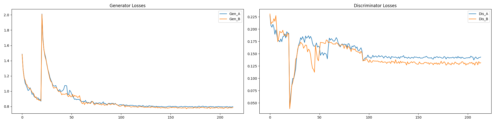
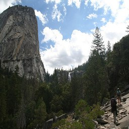
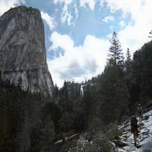
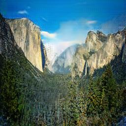
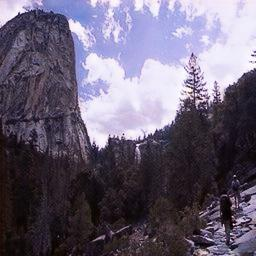

# Экспериментальные исследования и особенности реализации

В данном разделе представлены результаты экспериментов и ключевые особенности реализации. Основные материалы изложены в документе [ARCHITECTURE.md](ARCHITECTURE.md), посвященном архитектурным решениям и процессу обучения.

## Архитектурные решения и сравнительный анализ

Наиболее ресурсоемкие эксперименты были связаны с оптимизацией количества residual-блоков, слоев downsampling/upsampling и размерности скрытых состояний.

### Модель 1
- Количество residual-блоков: 9
- Количество downsampling/upsampling слоев: 2
- Размерность скрытого представления: 64
- Количество эпох обучения: 200

### Модель 2
- Количество residual-блоков: 2
- Количество downsampling/upsampling слоев: 1
- Размерность скрытого представления: 96
- Количество эпох обучения: 100

### Сравнительный анализ
Обучение второй модели характеризовалось сниженной стабильностью, но более высокой скоростью сходимости как в пересчете на время выполнения эпохи, так и по общему количеству итераций. 

| Оригинал | Модель 1 | Модель 2 |
|----------|----------|----------|
|  |  |  |

Модель 1 обеспечивает более плавные трансформации благодаря увеличенному количеству residual-блоков, но проявляет нестабильность в краевых случаях, обусловленную ограниченной размерностью скрытых состояний.

| Оригинал | Модель 1 | Модель 2 |
|----------|----------|----------|
|  |  |  |

Для второй архитектуры удалось увеличить размерность скрытых представлений с 64 до 96 ценой сокращения количества residual-блоков. Данная модификация позволила улучшить качество генерации и сократить время обучения с 15 до 12 минут на эпоху при использовании вычислительных ресурсов Google Colab.

Оптимальной конфигурацией для второй модели представляется увеличение количества residual-блоков до 4, что не было реализовано из-за ограничений вычислительных ресурсов.

## Особенности обучения

### Динамическая адаптация коэффициентов потерь
В процессе обучения второй модели применялась стратегия динамической корректировки весовых коэффициентов функций потерь. Данный подход существенно повлиял на финальную методологию обучения, которая представляет собой самостоятельное исследование. Ключевая концепция заключается в начальной фазе консервативного обучения с последующим увеличением давления на генераторы на определенных эпохах.

### Артефакты генерации и методы их устранения
Агрессивная настройка генераторов приводит к появлению структурных артефактов (сетчатой текстуры и других паттернов, зависящих от метода апсемплинга). В качестве контрмеры было применено увеличение коэффициентов `identity loss` и `cycle` loss, причем последний был увеличен сверх исходного значения. 

Дополнительно, для предотвращения фиксации дискриминаторов на артефактах, их скорость обучения (learning rate) была увеличена на 25% относительно генераторов. В сочетании со свойством оптимизатора Adam проявлять нестабильность при высоких значениях learning rate, это привело к улучшению результатов.

| Оригинал | До корректировки | После корректировки |
|----------|------------------|---------------------|
|  |  |  |

Незначительный синий оттенок на отдельных изображениях сохраняется, однако проблема структурных артефактов была существенно уменьшена. Представленное решение представляет собой компромисс между качеством трансформации и минимизацией артефактов.

## Эксперименты с апсемплом

Из исследований `SRGAN` и [научной публикации](https://arxiv.org/pdf/1609.05158) была заимствована концепция `PixelShuffle`, показавшая преимущества перед традиционным для `CycleGAN` подходом с использованием `ConvTranspose`.
