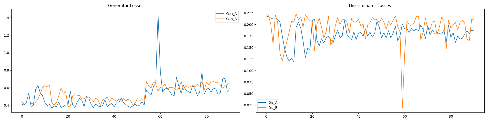
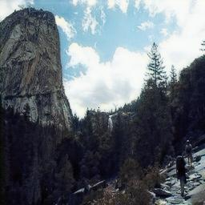

# Эксперименты и нюансы 
В этом блоке будет немало отссылок к тому, что было описано в [материале](ARCHITECTURE.md), что посвящен архитектре и обучению, советую сначала ознокомиться с ним. 

## Архитектура 
Самый долгий эксперимент был по выбору количества `residual`, `downsample`, `upsample` блоков, а также по размеру скрытого состояния. 

- Модель 1
  
  У нее было 9 `residual` блоков, по 2 `d/up sample` и размер скрытого состояния 64, обучалась 200 эпох.
  

- Модель 2
  
  У нее было 2 `residual` блока, по 1 `d/up sample` и размер скрытого состояния 96, обучалась 100 эпох.
  

- Сравнение
  
  Обучение второй модели явно было менее стабильным, но она обучалаась быстрее как по количеству времени на одну эпоху, так и по количеству эпох. К тожу же, визуалтный результат у нее тоже лучше.

  |оригинал|модель 1|модель 2|
  |-|-|-|
  |||

  Модель 1 делает преобразования мягче, за счет количества `residual` блоков, но имеет в разы больше краевых ситуаций, когда она просто ломается из-за слишком маленького размера скрытого состояния. 

  |оригинал|модель 1|модель 2|
  |-|-|-|
  |||

  Для второй модели удалось увеличить размер скрытого состояния только до 96 с 64, ради чего пришлось пожертвовать количеством блоков. Однако это сравнительно улучшило результаты и скоратило время обучения на коллабе с 15 инут на 1 эпоху до 12 минут.
  Для второй модели хотелось бы увеличить количество `residual` блоков хотябы до 4, чего ресурсы мне не повзволили сделать.

## Нюансы
(что это такое, Карс)

- Коэффициенты
  
  Во время обучения второй модели я на ходу менял соотношение функций потерь друг к другу чтобы посмотреть, как это отразится на поведении модели. Что весьма сильлно повлияло на финальный метод обучения, который по сути является тоже экпериментом. Суть в том, чтобы сначала обучить консервативную модель и затем на определенное количество эпох увеличить давление на генераторы. Это привело меня к следующей проблеме.

- Артефакты
  
  Агрессивность генератора приводит к сетчатым (или любым другим структурным, что зависит от метода апсемлинга) артфактам, я решил не уменьшать давление на генераторы, а увеличить `id loss` и `cycle loss`, причем `cycle loss` сделал выше прежнего. Также дискриминаторы могли застрять на артефактах, поэтому я увеличил их `lr` на 25% в сравнении с генераторами, что в сочетании со свойством `Adam` к нестабильной работе с высокими `lr`, дало результаты.

  |оригинал|до корректировки|после|
  |-|-|-|
  |||

  Небольшой синий оттенок появляется не на всех фотографиях и в принципе до корректировки сетчатость врезалась в глаза. В общем, это компромисс, тк я себе поставил задачу - уменьшить артефакты.

## SRGAN

  К сожалению, у меня не хватило ни времени, ни ресурсов, чтобы нормально обучить эту модель, гибкий класс расписан в данном [ноутбуке](../train/notebooks/train_SRGAN.ipynb). Из `SRGAN` и из этой [статьи](https://arxiv.org/pdf/1609.05158) я как раз взял идею с `pixelshuffle`, которая мне весьма понравилась. Тк в `Cycle GAN` зачастую используют тот же самый `ConvTransponse`
